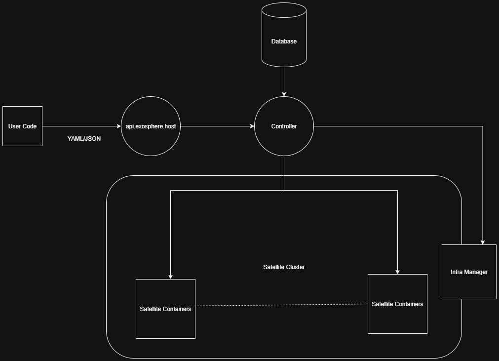

# Architecture
This page explains the architecture of working and implementation of `satellites`, `orbit` and working of apis and api server. 

## API Server
The main job of the API server is to handle the requests from the user and make sure of the following:

- Authentication
- Authorization
- Rate Limiting
- Error Handling

Further pass the request to the controller to handle the workflow gracefully.

## Controller
This is like the brain of the system and is responsible for the following:

- Scheduling the workflows
- Managing the state of the workflows
- Handling the errors
- Handling the logs 
- Requested necessary infrastructure resources to manage the satellites

## Orbit 
Container holding one or more satellites is referred as `orbit`. There are certain rules with each `orbit` has to follow:

- Should be a self-contained unit
- Should define the minimum hardware requirements
- Should implement standard exosphere interfaces and protocols

## Infra Manager
The role of the infra manager is to manage the underlying infrastructure and hardware resources as per the instructions from the controller.